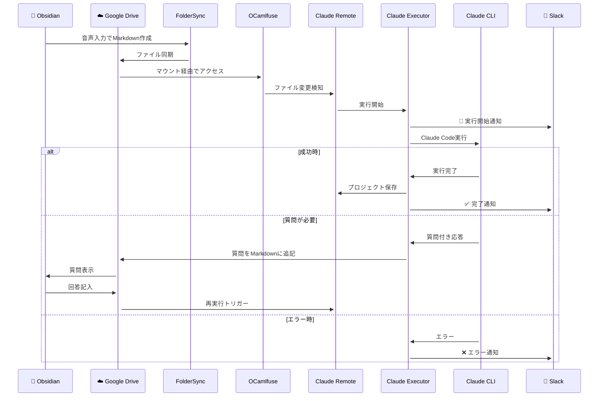

# Claude Remote

AndroidのObsidianで作成したメモを元に、Ubuntu PC上でClaude Codeを自動実行するシステムです。外出先からスマートフォンで音声入力したメモが、自動的にコードとして実現されます。

## 🎯 概要

Claude RemoteはObsidian + Google Drive + Claude Codeを組み合わせた、リモート開発支援システムです。

**ワークフロー：**
1. 📱 AndroidのObsidianで音声入力によりタスクを記録
2. ☁️ Google Driveで自動同期
3. 👀 Ubuntu PCでファイル変更を監視
4. 🤖 Claude Codeが自動実行
5. 📧 Slackに結果を通知

## 🏗️ システム構成図

```mermaid
graph TD
    subgraph "📱 Android"
        A[Obsidian App] --> B[Markdown Files]
        B --> C[FolderSync]
    end
    
    subgraph "☁️ Google Drive"
        C --> D[Google Drive Storage]
        D --> E[Obsidian Directory]
    end
    
    subgraph "🖥️ Ubuntu PC"
        F[Google Drive OCamlfuse] --> G[/gdrive/claude-remote]
        E --> F
        
        H[Claude Remote] --> I[Hash File Watcher]
        I --> G
        I --> J{File Changed?}
        
        J -->|Yes| K[Project Manager]
        K --> L[Claude Executor]
        
        L --> M{Execution Mode}
        M -->|Direct| N[Claude CLI]
        M -->|Docker| O[Docker Container]
        
        N --> P[Project Directory]
        O --> P
        
        P --> Q[/projects/project_timestamp/]
        Q --> R[src/]
        Q --> S[logs/]
        Q --> T[CLAUDE.md]
        
        L --> U[Question Detection]
        U -->|Questions Found| V[Append to Original MD]
        V --> G
        
        L --> W[Slack Notifier]
        W --> X[Slack Webhook]
    end
    
    subgraph "💬 Slack"
        X --> Y[Channel Notifications]
        Y --> Z[📱 Mobile/🖥️ Desktop]
    end
    
    style A fill:#e1f5fe
    style D fill:#fff3e0
    style H fill:#f3e5f5
    style Y fill:#e8f5e8
```

## 🔄 詳細ワークフロー



## ✨ 主な機能

- **🔍 高精度ファイル監視**: MD5ハッシュベースの確実な変更検知
- **📦 プロジェクト管理**: マークダウンファイルごとに独立したプロジェクトを自動作成
- **⚡ 柔軟な実行方式**: 直接実行（高速）とDocker実行（安全）の選択可能
- **💬 Slack通知**: リッチブロック形式での詳細な実行状況通知
- **🔄 トークン制限対応**: 指数バックオフによる自動再試行（最大10回）
- **🎤 音声入力最適化**: 特殊記法不要でObsidian音声入力に完全対応
- **❓ インテリジェント質問検出**: 正規表現による質問自動検出・追記システム
- **🛡️ 厳格なセキュリティ**: 最小限のツール権限（7種類のみ）で安全性確保
- **⚡ 非同期並行処理**: 最大3プロジェクトの効率的同時実行
- **💾 キャッシュシステム**: ファイルハッシュ永続化で高速起動
- **🔧 システム変更除外**: 質問追記等による無限ループ防止

## 📋 システム要件

- Ubuntu 20.04以降
- Python 3.8以降
- uv (Python パッケージマネージャー)
- Docker & Docker Compose
- Google Drive OCamlfuse（マウント済み）
- Claude CLI
- Slack Webhook URL

## 🛠️ 環境構築ガイド

### 📱 Android側の設定

#### 1. Obsidianのインストール
```bash
# Google Playストアからインストール
https://play.google.com/store/apps/details?id=md.obsidian
```

#### 2. FolderSyncのインストールと設定
```bash
# FolderSync Liteをインストール
https://play.google.com/store/apps/details?id=dk.tacit.android.foldersync.lite
```

**FolderSync設定手順：**
1. アプリを開き、「アカウント」タブでGoogle Driveアカウントを追加
2. 「フォルダペア」で新規ペアを作成：
   - **ローカルフォルダ**: Obsidianのvaultディレクトリ
   - **リモートフォルダ**: Google Drive上の任意のディレクトリ
   - **同期タイプ**: 双方向同期
   - **同期条件**: ファイル変更時に自動同期

#### 3. Obsidian Vault設定
1. Obsidianでvaultを作成または既存vaultを選択
2. FolderSyncで指定したディレクトリと同じ場所に配置
3. 音声入力設定を有効化（設定 > コアプラグイン > 音声録音）

### ☁️ Google Drive設定

Google DriveにObsidian用のディレクトリが自動的に作成されます。FolderSyncによって：
- Androidで作成したMarkdownファイルがGoogle Driveに同期
- Ubuntu PC側からアクセス可能な状態になります

### 🖥️ Ubuntu PC側の設定

#### 1. 前提条件のインストール

```bash
# システムのアップデート
sudo apt update && sudo apt upgrade -y

# 必要なパッケージのインストール
sudo apt install -y git curl build-essential python3 python3-pip docker.io docker-compose
```

#### 2. Google Drive OCamlfuseのセットアップ

```bash
# PPAを追加してインストール
sudo add-apt-repository ppa:alessandro-strada/ppa
sudo apt-get update
sudo apt-get install google-drive-ocamlfuse

# 認証設定（ブラウザが開きます）
google-drive-ocamlfuse -headless -label claude-remote

# マウントポイントの作成
sudo mkdir -p /gdrive
sudo chown $USER:$USER /gdrive

# マウント実行
google-drive-ocamlfuse -label claude-remote /gdrive

# 確認
ls /gdrive
```

#### 3. Claude CLIのインストール

```bash
# Claude CLIのインストール
curl -fsSL https://claude.ai/claude-cli.sh | sh

# 認証設定
claude auth login

# 注意: ~/.claudeディレクトリに認証情報が保存されます
# このディレクトリがDockerコンテナにマウントされるため、
# 環境変数でのAPIキー設定は不要です
```

#### 4. uvパッケージマネージャーのインストール

```bash
# uvのインストール
curl -LsSf https://astral.sh/uv/install.sh | sh
source $HOME/.cargo/env

# PATHに追加
echo 'export PATH="$HOME/.cargo/bin:$PATH"' >> ~/.bashrc
source ~/.bashrc
```

#### 5. Claude Remoteのセットアップ

```bash
# リポジトリのクローン
git clone https://github.com/your-username/claude-remote.git
cd claude-remote

# 依存関係のインストール
uv sync

# 設定ファイルの作成
cp .env.example .env
```

#### 6. 設定ファイルの編集

`.env`ファイルを編集：

```env
# Google Drive mount path (OCamlfuseでマウントしたパス)
GDRIVE_MOUNT_PATH=/gdrive/obsidian-vault

# Projects directory (生成されたコードの保存先)
PROJECTS_DIR=./projects

# Slack webhook URL (必須 - Slackワークスペースで取得)
SLACK_WEBHOOK_URL=https://hooks.slack.com/services/YOUR/WEBHOOK/URL

# Claude実行設定
CLAUDE_TIMEOUT=1800                 # 30分
MAX_CONCURRENT_EXECUTIONS=3         # 最大3並列
TOKEN_RETRY_INTERVAL=300           # 5分
MAX_TOKEN_RETRIES=10               # 最大10回再試行

# Docker設定（オプション）
DOCKER_IMAGE_NAME=claude-remote
DOCKER_NETWORK_NAME=claude-remote-net
```

#### 7. Slack Webhook URLの取得

1. [Slack API](https://api.slack.com/apps)でアプリを作成
2. 「Incoming Webhooks」機能を有効化
3. ワークスペースにインストール
4. Webhook URLをコピーして.envファイルに設定

#### 8. Dockerセットアップ（オプション）

```bash
# Dockerイメージのビルド
docker build -f docker/Dockerfile -t claude-remote .

# ネットワークの作成
docker network create claude-remote-net

# Dockerサービスをユーザーグループに追加
sudo usermod -aG docker $USER
newgrp docker
```

### 🚀 システム起動

```bash
# Google Driveをマウント（起動時に必要）
google-drive-ocamlfuse -label claude-remote /gdrive

# Claude Remoteの実行
cd claude-remote
uv run python -m claude_remote.main

# または
make run
```

## 🚀 クイックスタート

### 簡単セットアップ（推奨）

```bash
# 全自動セットアップスクリプト
git clone https://github.com/your-username/claude-remote.git
cd claude-remote
chmod +x setup.sh
./setup.sh

# 設定ファイルを編集
nano .env

# 実行
make run
```

### 手動セットアップ

```bash
# 1. リポジトリの取得
git clone https://github.com/your-username/claude-remote.git
cd claude-remote

# 2. 依存関係のインストール
uv sync

# 3. 設定ファイルの作成
cp .env.example .env
# .envファイルを編集してください

# 4. 実行
uv run python -m claude_remote.main
```

## 🛠️ 開発者向けコマンド

```bash
# 開発環境のセットアップ
make dev

# テストの実行
make test

# コードフォーマット
make format

# リンターの実行
make lint

# Dockerログの確認
make logs

# 使用可能なコマンド一覧
make help
```

## 📝 使い方

### 基本的な使い方

1. **Obsidianでメモを作成**
   - AndroidのObsidianで新しいマークダウンファイルを作成
   - 音声入力でClaude Codeへの指示を記述
   - 例：「Pythonで簡単な計算機アプリを作って」

2. **自動実行**
   - Google Driveで同期されると自動的に監視システムが検知
   - Claude Codeが指示を解釈して実行
   - 進捗がSlackに通知される

3. **結果の確認**
   - 生成されたコードは`/projects`ディレクトリに保存
   - 実行ログで詳細を確認可能

### 高度な使い方

**作業ディレクトリの指定：**
```markdown
作業ディレクトリ: /path/to/specific/directory

Reactアプリケーションを作成してください...
```

**追加情報が必要な場合：**
システムが自動的にClaude Codeからの質問を検出し、元のマークダウンファイルに質問を追記します。タイムスタンプ付きで管理され、回答後にファイルを更新すると再実行されます。

## 📁 ディレクトリ構造

```
claude-remote/
├── claude_remote/         # メインパッケージ
│   ├── __init__.py       # パッケージ初期化
│   ├── main.py           # メインアプリケーション
│   ├── hash_file_watcher.py # ハッシュベースファイル監視（メイン）
│   ├── file_watcher.py   # Git連携ファイル監視（サブ）
│   ├── claude_executor.py # Claude Code実行（質問検出機能付き）
│   ├── slack_notifier.py # Slack通知
│   ├── project_manager.py # プロジェクト管理
│   └── config.py         # 設定管理
├── docker/               # Docker設定
│   ├── Dockerfile
│   └── docker-compose.yml
├── projects/             # 生成されるプロジェクト
│   └── project_YYYYMMDD_HHMMSS/
│       ├── CLAUDE.md     # プロジェクト仕様
│       ├── src/          # 生成コード
│       ├── logs/         # 実行ログ
│       └── .project_info.json
├── pyproject.toml        # uvプロジェクト設定
├── uv.lock              # 依存関係ロックファイル
├── .python-version      # Python バージョン指定
├── .env.example         # 設定テンプレート
├── run.py               # 実行スクリプト
└── README.md
```

## 🔔 Slack通知の種類

| アイコン | 通知内容 | 説明 |
|---------|----------|------|
| 🚀 | 実行開始 | Claude Code実行が開始されました |
| ✅ | 実行完了 | 正常に実行が完了しました |
| ⚠️ | 軽微なエラー | 再試行で解決可能なエラー |
| ❌ | 重要なエラー | ユーザー対応が必要なエラー |
| 🚨 | 致命的なエラー | システムエラー（詳細ログ付き） |
| ⏳ | トークン制限 | API制限による待機状態 |

## 🛠️ トラブルシューティング

### Google Driveマウントの問題

```bash
# マウント状態確認
mount | grep gdrive

# 再マウント
umount /gdrive
google-drive-ocamlfuse /gdrive

# 権限確認
ls -la /gdrive/claude-remote
```

### Docker関連の問題

```bash
# Docker権限エラー
sudo usermod -aG docker $USER
# 再ログインが必要

# コンテナログ確認
docker logs claude-remote

# ネットワーク確認
docker network ls | grep claude-remote
```

### Claude API関連の問題

```bash
# API キー確認
echo $ANTHROPIC_API_KEY

# Claude CLIテスト
claude --version
claude "Hello, world!"
```

### ログの確認方法

```bash
# リアルタイムログ
tail -f projects/*/logs/execution_*.log

# 特定プロジェクトのログ
cat projects/project_20240713_143022/logs/execution_20240713_143022.log

# システムログ
journalctl -u claude-remote
```

## ⚙️ 設定オプション

| 環境変数 | デフォルト | 説明 |
|----------|------------|------|
| `GDRIVE_MOUNT_PATH` | `/gdrive/claude-remote` | Google Driveマウントパス |
| `PROJECTS_DIR` | `/projects` | プロジェクト保存ディレクトリ |
| `CLAUDE_TIMEOUT` | `1800` | Claude Code実行タイムアウト（秒） |
| `MAX_CONCURRENT_EXECUTIONS` | `3` | 最大同時実行数 |
| `TOKEN_RETRY_INTERVAL` | `300` | トークン制限時の再試行間隔（秒） |
| `MAX_TOKEN_RETRIES` | `10` | 最大再試行回数 |

## 🔒 セキュリティ

- **Docker隔離**: Claude Codeは専用Dockerコンテナ内で実行
- **ネットワーク制限**: 必要最小限のネットワークアクセスのみ許可
- **リソース制限**: CPU・メモリ使用量を制限
- **ファイルアクセス制限**: プロジェクトディレクトリのみアクセス可能

## 🤝 コントリビューション

1. このリポジトリをフォーク
2. 機能ブランチを作成 (`git checkout -b feature/amazing-feature`)
3. 変更をコミット (`git commit -m 'Add amazing feature'`)
4. ブランチにプッシュ (`git push origin feature/amazing-feature`)
5. プルリクエストを作成

## 📄 ライセンス

MIT License - 詳細は[LICENSE](LICENSE)ファイルを参照

## 🆘 サポート

- **Issues**: [GitHub Issues](https://github.com/your-username/claude-remote/issues)
- **Discussions**: [GitHub Discussions](https://github.com/your-username/claude-remote/discussions)
- **Wiki**: [プロジェクトWiki](https://github.com/your-username/claude-remote/wiki)

## 📚 関連リンク

- [Claude Code Documentation](https://docs.anthropic.com/claude/docs)
- [Obsidian](https://obsidian.md/)
- [Google Drive OCamlfuse](https://github.com/astrada/google-drive-ocamlfuse)
- [Slack Webhooks](https://api.slack.com/messaging/webhooks)